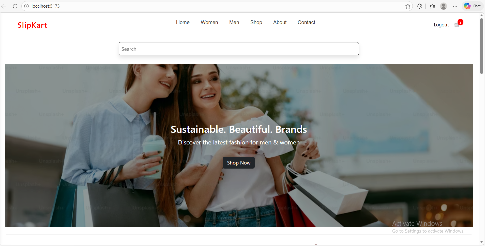
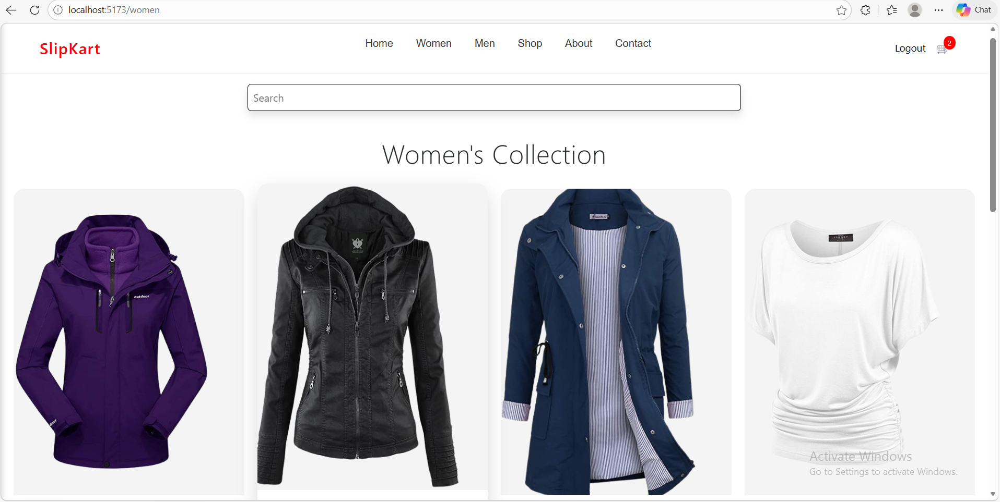
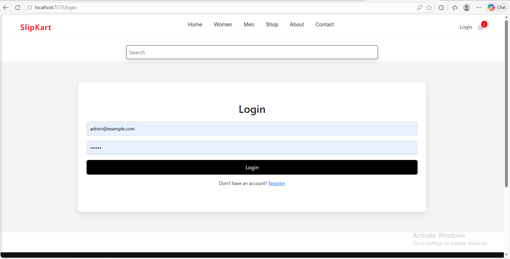

# 🛒 Slipkart - E-commerce Web App

## 🚀 Live Demo

🔗 https://slipkart-seven.vercel.app/

---

## 📌 Overview

Slipkart is a modern e-commerce web application .
It allows users to browse products, add items to cart, and simulate an online shopping experience with a clean and responsive UI.

---

## ✨ Features

* 🛍️ Product listing page
* 🔍 Search & filter functionality
* 🛒 Add to cart / Remove from cart
* 🔐 Authentication (Login/Signup)
* 💰 Price calculation
* 📱 Fully responsive design
* ⚡ Fast performance with optimized React components

---

## 🛠️ Tech Stack

* **Frontend:** React.js
* **Styling:** CSS , bootstrap (basic use)
* **State Management:** useState / Redux
* **Deployment:** Vercel
* **Version Control:** Git & GitHub

---

## 📸 Screenshots

### 🏠 Home Page


### 👗 Women Page


### 🔐 Login Page


---

## ⚙️ Installation & Setup

Clone the repository:

```bash
git clone https://github.com/harman077/slipkart.git
```

Navigate to the project:

```bash
cd e-commerce-react
```

Install dependencies:

```bash
npm install
```

Run the app:

```bash
npm run dev
```

---

## 📂 Project Structure

```
src/
 ├── components/
 ├── pages/
 ├── context/
 ├── assets/
 └── App.js
```

---

## 🎯 What I Learned

* Building reusable React components
* State management and props handling
* Handling real-world UI structure
* Deploying production-ready apps

---
